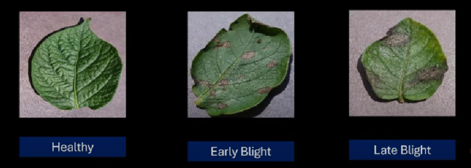

# Potato-Disease-Classifier-using-CNN-End-to-end-project

Here, I am following [this](https://www.youtube.com/playlist?list=PLeo1K3hjS3ut49PskOfLnE6WUoOp_2lsD) YouTube tutorial to create Potato Disease Classifier using CNN.

### Targets of project:
1. Problem Statement definition
2. Data Collection and Preprocessing
3. Model Building
4. FastAPI for backend
5. Website in ReactJS
6. Image Data Generator API
7. Model Deployment
8. Mobile App in React Native (Not confirmed target)

### What I will learn after this Project:
1. How to clearly define Problem Statement
2. Creating Model from given problem statement
3. Data preprocessing practice
4. FastAPI 
5. How to use ReactJS to create website for Model deployment

## Domain Information (Problem Statement)
### Types of disease we are going to classify:
1. Early Blight
2. Late Blight

Predicting disease early and treating potato plant fast can help farmers saving their crop.  
It eventually helps farmer financially and help them saving crop from getting wasted. 

### How we will solve it.
Farmer will gave web application (and probably mobile application) using which, farmer can take image of plant.  
Model will process that image and show farmer the results directly.  
It is basically very simple UI app (which is actually required because one cannot expect farmer to be on higher side of tech).  
As the application is easy and requires very less computing power, it is convinient to use.

### Catagories to predict.
1. Healthy
2. Early Blight
3. Late Blight

### Technical Information
##### Model Building Technologies
1. Tensorflow
2. Model: Convolutional Neural Network
3. Data Preprocessing: Data Augmentation (Using TF dataset)

##### Backend Server
1. Tensorflow Serving 
2. FastAPI

##### Model Optimization
1. Quantization
2. Tensorflow Lite

##### Frontend
1. ReactJS
2. React Native (Possible)
3. GCP for deployment (Not sure about this one)